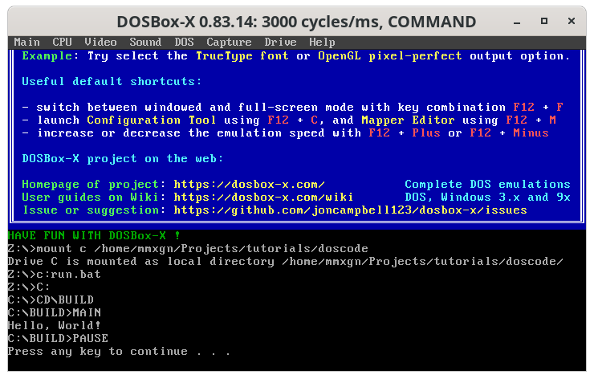

Title: Using Visual Studio Code as an IDE for making DOS Programs (part 1)
Date: June 15, 2021
Tags: programming, DOS, vscode
Category: Blog
Authors: Emmanouil Theofanis Chourdakis
Summary: How to set up tasks in vscode in order to use dosbox to compile stuff

# Introduction

While I have done some game programming using modern game engines, I would like to go a bit deeper into how those engines work, and try to make a little game in an engine of my own. While I can use libraries such as [SDL](https://www.libsdl.org/download-2.0.php) or [RayLib](https://www.raylib.com/) on a modern system, using modern IDEs, etc, I want to go a bit more bare-bone. Inspired by [a YouTube video on DOS programming in 2019](https://www.youtube.com/watch?v=f9kaOk0a664) and [a Reddit discussion I came across](https://www.reddit.com/r/gamedev/comments/nu7mx8/how_can_i_get_started_with_gamegraphics/h0w2bky/?context=3), I will try to make my own game-engine, for educational purposes (I don't know what it's going to be focused yet). The engine will run on dosbox. The code, however, I want to write on a modern IDE since, nostalgia aside, I will surely miss modern editor environment features. Since I am using VSCode at work and I am familiar with it, I will mostly use that. 

# Configuring VSCode to run applications with `dosbox`

This part is surprisingly easy. I will assume you have installed dosbox (I am actually using dosbox-x and **strongly** recommend you do the same) to your system and is in the system path. If not, just replace `dosbox-x` in the following steps to your full `/path/to/dosbox` (or `C:\path\to\dosbox.exe` on windows) path. Create an empty folder where you will store your project, open it with VSCode (`File -> Open Folder...`). Now we have to do two things:

1. Tell VSCode how to compile and run our files.
2. Assign key-bindings to the above tasks.

To do that, we create a folder: `.vscode`. In it create a file: `tasks.json`. In `tasks.json`, add (replace `dosbox-x` below with your version of the dosbox binary):

```json
{
    "version": "2.0.0",
    "tasks": [
        {
            "type": "shell",
            "label": "Compile",
            "command": "dosbox-x",
            "args": [
                "-c",
                "mount c ${workspaceFolder}",
                "-c",
                "c:\\compile.bat"
            ],
            "group": {
                "kind": "build",
                "isDefault": true
            }
        },
        {
            "type": "shell",
            "label": "Run",
            "command": "dosbox-x",
            "args": [
                "-c",
                "mount c ${workspaceFolder}",
                "-c",
                "c:\\run.bat"
            ],
            "group": {
                "kind": "test",
                "isDefault": false
            }

        }        
    ],
  }
```

What this does is create two new tasks: `Compile` and `Run`. When you select `Compile` it executes dosbox, mounts the workspace folder to `c:`, and executes `compile.bat`. `Run` is similar to `Compile` but executes `run.bat` instead. If you need to add more DOS commands, those need to be preceded by the `"-c"` argument and in double quotes (`"`). The `"group"` keyword assigns what type of task we have described. Saying to VSCode that `Compile` is of group kind `build` let's us execute it with the build key-binding (`shift+ctrl+b`). To assign a key-binding to `Run`, press `ctrl+k` to bring up the Keyboard Shortcuts window, click below `Keybinding` next to `Tasks: Run Test Task` and click a desired key combination for running your program (I chose `F9`). Press `Ctrl+S` to now save the keybinding. Finally, create the files `compile.bat` and `run.bat` in the root of the workspace directory. We will leave them empty for now.


# Installing a compiler

So where/how should we install the compiler? First of all you have to find it somewhere (I will not tell you where, if you made it this far you can probably use a search engine). Your method of installation might differ, however to showcase it let's suppose we have an archive of Borland Turbo C++ 1.01 which contains a bunch of `.img` files. To set it up, start by running dosbox and mounting the root of the workspace directory (cool trick: just press `ctrl+shift+b` to run the dummy `compile` command). Then (if you are using dosbox-x) select `Drive -> A -> Mount multiple disk/CD images`, navigate to the folder where the `.img` files are, and select them all. Then execute:

```
Z:\> a:

A:\> install

```

Go ahead with the defaults, and select `Start Installation`. If it asks you for a new disk, select `Drive -> A -> Swap Disk` from the dosbox-x menu and press enter. If the disk is incorrect, press `ESC` and repeat `Drive -> A -> Swap Disk`, enter (until it swaps with the correct floppy image). Repeat that process until you are left to the following screen:


Finally add two empty directories `src` and `build`, and also add the following to your `compile.bat` and `run.bat` files:

`compile.bat`:

```batch
C:
CD\TC\BIN
TCC.EXE C:\SRC\MAIN.C
COPY MAIN.EXE C:\BUILD
PAUSE
EXIT
```

`run.bat`
```batch
C:
CD\BUILD 
MAIN
PAUSE
EXIT
```

Where the last two lines pause after execution and close the dosbox window. Of course, if your compiler differs/you want to alter program structure etc, you need to adapt those files accordingly.

# Testing the setup

Finally, lets add a file `src/main.c`:

```c
#include <stdio.h>

void main() {
    printf("Hello, World!\n");
}
```

Press `ctrl+shift+b` to build:


And `F9` to run `build/main.exe`:




That's it! Happy dos-coding!
